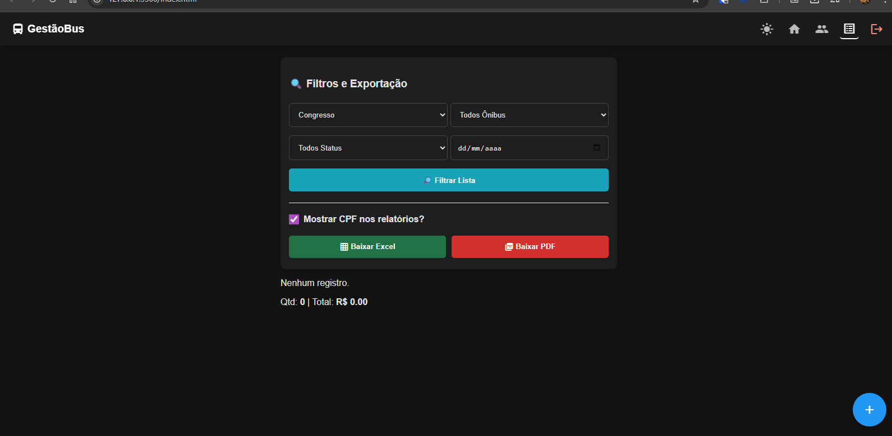

 # 🚍 GestãoBus Pro

Sistema web completo para gestão de viagens, excursões e controle de passageiros. Desenvolvido para facilitar a organização de eventos como Assembleias e Congressos, com foco em agilidade no cadastro e controle financeiro.


## 🎯 Funcionalidades Principais

### 1. 📝 Gestão de Passageiros
* **Cadastro Rápido:** Formulário otimizado para lançar passageiros em segundos.
* **Status Financeiro:** Controle visual de quem está **Pago (Verde)** ou **Pendente (Vermelho)**.
* **Edição e Exclusão:** Botões rápidos de lápis e lixeira para corrigir erros.

### 2. 🧠 Base de Clientes Inteligente
* **Cadastro Automático:** Opção de salvar passageiros frequentes na base de dados durante o lançamento da viagem.
* **Autopreenchimento:** Ao digitar o nome de um cliente conhecido, o sistema preenche o CPF automaticamente.
* **Gestão da Base:** Aba dedicada para visualizar, editar e excluir clientes fiéis.

### 3. 📊 Relatórios e Exportação
* **Filtros Avançados:** Filtre por Evento, Número do Ônibus, Status de Pagamento ou Data.
* **Controle de Privacidade:** Opção (Checkbox) para **ocultar ou mostrar o CPF** nas listas geradas.
* **Exportação Excel (.csv):** Gera planilhas formatadas para o padrão brasileiro (acentos e separadores corretos).
* **Impressão/PDF:** Layout limpo e profissional, ideal para listas de embarque (Manifesto).

### 4. 💻 Interface e Usabilidade
* **Caixa em Tempo Real:** Dashboard que soma o total arrecadado e o total pendente instantaneamente.
* **Design Responsivo:** Funciona perfeitamente no computador e no telemóvel.
* **Modo Escuro (Dark Mode):** Ícone de Sol/Lua para alternar temas e descansar a visão.
* **Barra "Slim":** Navegação fixa e compacta no topo da tela.

---

## 🛠️ Tecnologias Utilizadas

* **HTML5 & CSS3:** Estrutura e estilização moderna (Flexbox, Variáveis CSS).
* **JavaScript (Vanilla):** Lógica de negócios, manipulação do DOM e exportação de arquivos.
* **Firebase (Google):**
    * **Firestore:** Banco de dados NoSQL em tempo real.
    * **Authentication:** Sistema de Login seguro.

---

## 🚀 Como Rodar o Projeto

1.  Clone este repositório:
    ```bash
    git clone [https://github.com/SEU-USUARIO/GestãoBus.git](https://github.com/SEU-USUARIO/GestãoBus.git)
    ```
2.  Abra o arquivo `index.html` no seu navegador.
3.  **Nota:** É necessário ter as chaves de API do Firebase configuradas no arquivo `app.js` para que o banco de dados funcione.

---

## 📸 Demonstração



O sistema conta com impressão otimizada para listas de chamada:

> **Dica:** Ao clicar em "Baixar PDF", o sistema abre a janela de impressão do navegador. Selecione "Salvar como PDF" para gerar o arquivo.

---

## 📄 Licença

Este projeto foi desenvolvido para fins de gestão pessoal e portfólio.